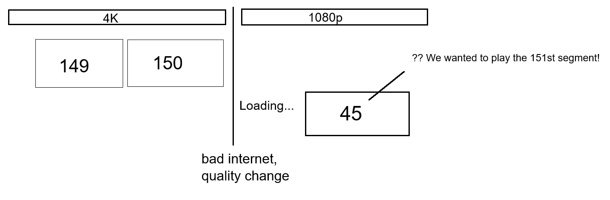
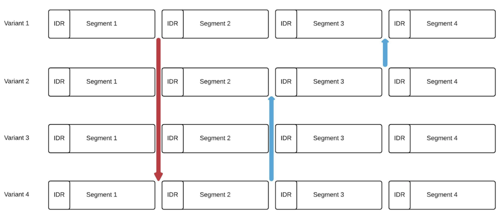
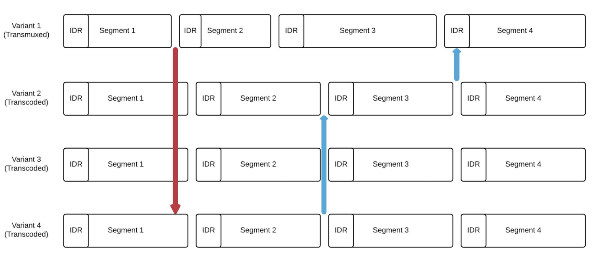
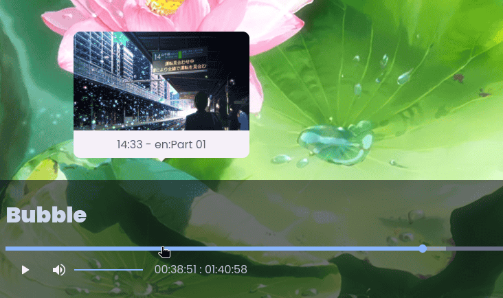

For [Kyoo](https://github.com/zoriya/kyoo), I need to play video on a variety of clients (browsers, TVs, mobile apps). Clients does not always support the video codec of the source video since videos are user provided. Any valid video should work everywhere. Users should not have to worry about converting videos for Kyoo to work, everything should Work™ the first time.

Users don't always have a stable connection, but they should be able to play their video. Even if they are on a train. Those constraints mean that Kyoo needs a service to change videos codec and file size (transcode) on the fly. Why on the fly? Because we don't want users to store all their videos 5 times (the original, a 480p version, a 720p version and so on).

## The goal

The service should be able to:
 - Stream a video file
 - Allow users to select the video quality
 - Allow clients to automatically select the best video quality it can play (and auto-switch when internet speed changes)
 - Prefer the original video if it can be played by the device/connection speed

The last point is particularly important since Kyoo is self-hosted and user's servers are not always powerful enough to always transcode video. For example a Raspberry Pi will not be able to transcode videos, but simply transmuxing and conserving the original video stream is possible.

As for any video services, the following points should also be satisfied:
 - Start playing fast (we don't want to wait 30s to start watching a movie)
 - Allow users to seek anywhere on the media at any point

## The constraints

To allow clients to change quality when the connection's speed changes, two standards exist. HLS and Dash. Both are widely supported and offer the same benefits and constraints. I used HLS, but I believe the two could be used interchangeably without too much issue.

### HLS: an introduction

I'm going to give you a brief overview of what HLS looks like. It consists of 3 types of files:

 - Segments, small chunks (should be between 2s and 10s) of video or audio (in a .ts or .mp4 container).
 - Index/segments playlist (.m3u8), a file listing every segments' URL and their length.
 - Master playlists (.m3u8) that contains the list of variants (720p, 1080p, 4k...).
<details>
<summary>Example index.m3u8 playlist</summary>

```m3u8
#EXTM3U
#EXT-X-VERSION:3
#EXT-X-PLAYLIST-TYPE:VOD
#EXT-X-ALLOW-CACHE:YES
#EXT-X-TARGETDURATION:4
#EXT-X-MEDIA-SEQUENCE:0
#EXT-X-INDEPENDENT-SEGMENTS
#EXTINF:8.800000
segment-0.ts
#EXTINF:6.048000
segment-1.ts
#EXTINF:5.172000
segment-2.ts
...
#EXTINF:3.712000
segment-258.ts
#EXTINF:6.507000
segment-259.ts
#EXT-X-ENDLIST
```
</details>

<details>

<summary>Example master.m3u8 playlist</summary>

```m3u8
#EXTM3U
#EXT-X-STREAM-INF:AVERAGE-BANDWIDTH=1440118,BANDWIDTH=1728141,RESOLUTION=1280x720,AUDIO="audio",CLOSED-CAPTIONS=NONE
./original/index.m3u8
#EXT-X-STREAM-INF:AVERAGE-BANDWIDTH=400000,BANDWIDTH=700000,RESOLUTION=427x240,CODECS="avc1.640028",AUDIO="audio",CLOSED-CAPTIONS=NONE
./240p/index.m3u8
#EXT-X-STREAM-INF:AVERAGE-BANDWIDTH=800000,BANDWIDTH=1400000,RESOLUTION=640x360,CODECS="avc1.640028",AUDIO="audio",CLOSED-CAPTIONS=NONE
./360p/index.m3u8
#EXT-X-STREAM-INF:AVERAGE-BANDWIDTH=1200000,BANDWIDTH=2100000,RESOLUTION=853x480,CODECS="avc1.640028",AUDIO="audio",CLOSED-CAPTIONS=NONE
./480p/index.m3u8
#EXT-X-MEDIA:TYPE=AUDIO,GROUP-ID="audio",NAME="Stereo",URI="./audio/0/index.m3u8"
```

</details>

Now that we know what we want, let's talk about how we could proceed.

### Generate HLS via ffmpeg

When dealing with video content, ffmpeg always comes to the rescue. We can generate HLS streams with the following command:

```bash
ffmpeg -i input.mkv -map 0:V:0 -map 0:a:0 \
  -c:v libx264 -b:v 2400000 -bufsize 20000000 -maxrate 4000000 \
  -c:a aac -ac 2 -b:a 182k \
  -f hls output.m3u8
```

<details>
<summary>Command breakdown</summary>

- `ffmpeg`
- `-i input.mkv`: Specify input file
- `-map 0:V:0`: Only use the first video stream (`0:` means first input, `V` means video, `:0` means first stream matching). Note that `v` also exists but can contain cover arts instead of video stream
- `-map 0:a:0`: Only use the first audio stream.

- `-c:v libx264`: Specify the video codec, here we take h264, the most commonly supported one
- `-b:v 2400000`: Specify the average bit rate of the video
- `-bufsize 20000000`: How often the encoder should check for bit rate and apply corrections
- `-maxrate 4000000`: Maximum bit rate

- `-c:a aac`: Specify the audio codec
- `-ac 2`: Specify the number of audio channels
- `-b:a 182k`: Average audio bit rate

- `-f hls`: Specify the output format to be HLS.
- `output.m3u8`: Specify the name of the index playlist.

</details>

This naive command does not support automatic quality switches. We would need a command like this for quality switches:

```bash
ffmpeg -i input.mkv -map 0:V:0 -c:v libx264 \
  -filter:v:0 scale=480:360  -b:v:0  800000 \
  -filter:v:1 scale=640:480  -b:v:1 1200000 \
  -filter:v:2 scale=1280:720 -b:v:1 2400000 \
  -var_stream_map "v:0,name:360p v:1,name:480p v:2,name:720p" \
  -f hls output.m3u8
```

<details>
<summary>Command breakdown</summary>

- `ffmpeg -i input.mkv -map 0:V:0 -c:v libx264`: same as the previous command

- `-filter:v:0 scale=480:360`: Specify filter for the first video stream only, here we want to scale the video to 360p.
- `-b:v:0 2400000`: Here we specify the bitrate of only the first video stream, with `v:0`

- `-var_stream_map "v:0,name:360p v:1,name:480p v:2,name:720p"`: Specify names for each stream. This flag could also be used to tell ffmpeg to merge audio and video in the same segments files, for example by using `v:0,a:0,name:360pWithAudio`.
- `-f hls output.m3u8`: Same as the previous command but this time, `output.m3u8` refers to the master playlist instead of the index one.

</details>

This command will eagerly transcode the video in all qualities ; killing the server's performances while doing so.

The two previous commands share a common pitfall: the commands will produce HLS segments one at a time starting from the first. Streaming this file will show users a video of 30s growing until the command has finished.

![vlc gif of this command playback]

The user can't seek past the transcoded end. They need to wait for the transcoder to reach the point they want to seek to.

## The solution

The master playlist we saw earlier is pretty simple (and human-readable!). We could manually generate it and create transcode streams only when they are requested. This was my initial approach as it's pretty simple to implement, but it has a major flaw.

### First flaw

What happens when you switch quality? Your player will fetch the index.m3u8 file for the new quality. Receiving this request, the server will start a new transcode and give back the index file.<br/>
Let's pretend your client was playing the 150th segment at 5 min of your movie in 4k. Your internet connection gets worse and your client requests the version in 1080p. The transcode starts and your clients receives the newly created `index.m3u8`.<br/>
Since transcoding has just started, it might only have 50 segments in it. Your player will not be able to request the segment 150 of the new quality (since it does not exist in the `index.m3u8` yet) and start playing at the 45th segment (to keep a margin from the stream tip).<br/>
The user will now have to rewatch part of the movie or wait for the transcoder to catch up and manually seek.



So how should we fix that? The obvious idea is to start the new encode directly at the requested segment, so users don't have to wait.<br/>
While the idea is pretty simple, actually implementing it is a lot harder. First, you want to start the transcode at a specific segment, but you don't know the start time in seconds of that segment. And even if we knew the start time of the segment, we can't simply remove previous segments from the index.m3u8 file. It's illegal to do so and the player would not be able to seek before in the video.

### Alignments

In truth, HLS has another rule: each variant needs to have their segments aligned (same length and start time). I'll steel a diagram from a twitch's blog:



You can see that each segment is aligned: they start and end at exactly the same time in all variants. This makes it easy to switch quality/variant at any point (as illustrated by the arrows).

In ffmpeg, we can either use `-segment_time` to specify a single length for all segments, or we can use `-segment_times` and specify an array of length with one value per segment.<br/>
If we tried to run a ffmpeg command with this flags, you would quickly notice an issue: segments are not at the right duration! This is because a segment must start with a keyframe (the `IDR` in the previous illustration).

While we can manually create keyframes at the start of segment when we transcode (using the `-force_key_frames` flag), we have no control over keyframes when we transmux (keep the original video stream). This means we could have a HLS setup like this:



Clients watching this stream could not change quality without replaying or skipping part of a segment. Let's take a step back and focus on what's a keyframe before searching for a solution.

## About keyframes

### What's a keyframe

So, what's a keyframe: it's an independent frame (I-frame) in a video stream. Think of it has an image. Video frames can either be independent (keyframes) or dependent on another frame. A dependent frame does not store the whole image but the differences relative to another frame.


In the previous illustration, you can see on the top row what you would see when playing the video. On the bottom row, you can see video frames. I-frames are keyframes, P-frames and B-frames are both dependent frames (B-frames are `bidirectionally predicted pictures`, it can depend on both previous and future frames). You can read more about I/P/B frames on [Wikipedia](https://en.wikipedia.org/wiki/Inter_frame).<br/>
With this new knowledge about dependent frames, you can now understand why segments must start with a keyframe. A player could not show the image without the preceding keyframe anyway.

So we absolutely need to allow playback of the original video stream, where we have no control of keyframes. There can be a keyframe every frame, or we could have 3 minutes of video without any keyframe. Segments still need to start with a keyframe, even in original quality.

### Allowing original playback

There is only one way to align the original video stream with the transcoded stream: giving up control on fixed segments length and aligning on the original keyframes. Since we can control the transcoded's stream keyframe, we can put them at the same times as the original's stream keyframes.<br/>
This means we can't simply create a keyframe/segment every 4s, we need to scan the whole video to extract keyframes timestamps and create a new segment only on one of those timestamps.

When creating the hls stream from the original video stream, we simply cut segments at a previously extracted keyframes. For transcoded stream, we force keyframes and segments cut exactly like before but we use the original's video keyframes as a reference.

To extract keyframes from a video file, we can use ffprobe, a tool that ships with ffmpeg. The following command gives keyframes:

```bash
ffprobe -loglevel error -select_streams v:0 \
  -show_entries packet=pts_time \
  -skip_frame nokey \
  -of csv=print_section=0 input.mkv
```

If you run this command, you will notice that it's extremely slow. That's because the `-skip_frame nokey` argument is a decoder argument, so it needs to decode all video frames and then discard the frames which are not keyframes. We can effectively do the same thing 20 times faster by manually filtering keyframes.

```bash
ffprobe -loglevel error -select_streams v:0 \
  -show_entries packet=pts_time,flags \
  -of csv=print_section=0 input.mkv \
  | awk -F',' '/K/ {print $1}'
```

This command will output something like that:

```
0.000000
2.002000
4.004000
6.006000
8.008000
10.010000
12.012000
14.014000
16.016000
18.018000
20.020000
22.022000
```

in a few seconds. We can use that before starting a transcode to know where we should cut segments.



Kyoo actually start transcoding before every keyframes could be retrieved since on slow HDD, keyframe extraction can take up to 30 seconds. This ensures that you wait for a minimum amount of time before playback start. Since keyframes are cached for later uses, this process is transparent for users, and you can resume playback from the middle of your movie latter if you want.



## Wrapping up

You now have a good idea of how streams can be created. The transcoder's job is also to keep and manage state to handle multiples users that can seek or change files, but that's not the point of this blog.

Another important point about video transcoding is the difference between each format/setup. Ffmpeg handle almost every case, but it always has some quirks or obscure flags.<br/>
For example, hardware acceleration, aka using your graphics card for faster transcode is one of them. Not because it's hard per se since ffmpeg abstracts this for us. It's hard because it adds edge cases. To give a simple example, the `-force_keyframes` option that we used to create an IDR frame at every given timestamp does not create IDR frames when using CUDA (Nvidia's hardware acceleration). The frame created is still an I-frame, so it's not a bug in ffmpeg but this results in an invalid HLS stream. For this specific case, we need to use the `-force_idr 1` option that, to my knowledge, only CUDA specific encoders read.

I iterated a lot on this transcoder, my first implementation was written in C and used ffmpeg's library directly (this was also my first C and low level project, I had never heard of a pointer before). Everybody told me this was a bad idea and I should just create a node process that would call ffmpeg. While this was the right call if I wanted to quickly create a transcoder, learning to read the ffmpeg's source code and how it worked inside gave me lots of insights. Insights I still use today when working in today's transcoder, after rewriting everything in Rust and then in Go. Each rewrite originated from perspective shift on how to process state and streams, leading to the current implementation that finally archived every goal.

Kyoo's transcoder also has other features that resolve around video like extracting subtitles, fonts or media thumbnails for seeking (see picture below).


It's still a moving project with new features coming, but the core transcoding process is done and fully working! The next feature that will probably come is intro/outro detection using audio fingerprints.

This was my first blog about Kyoo's development, If you want to read more about a specific topic, please manifest yourself! If you liked this article, consider sharing it or staring [Kyoo](https://github.com/zoriya/kyoo) on github.

<!-- vim: set wrap: -->

