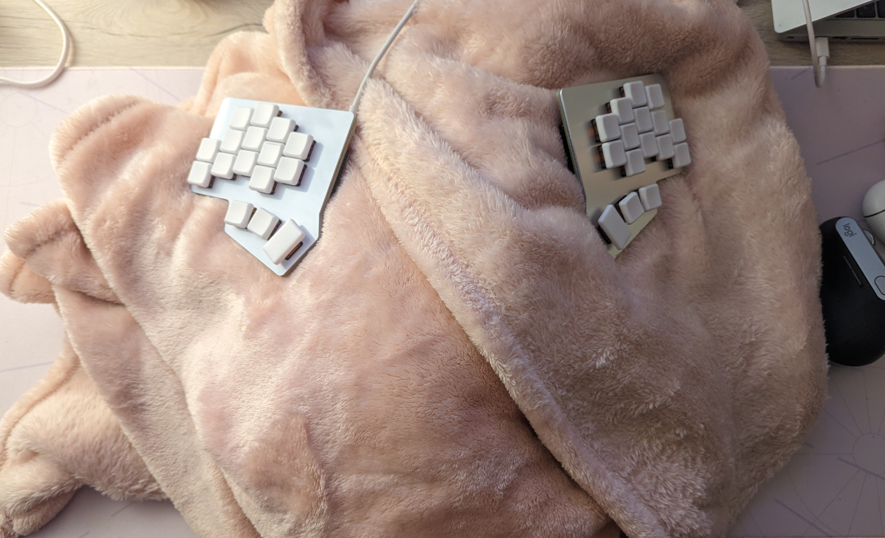

I use a lot of nerdy tools (linux, nix, river), some tools also have a steep learning curve (vim, dvorak). I also type on a [32 split keyboard](https://github.com/zoriya/abyss) I made myself.

A lot of developers would say I am wasting time, using tools that have no use or slow me down, and I should stop to ship some products.

I also write code in a lot of different language (21 according to my github stats) and I still do not have a favorite language. Nor do I have a go-to language when I want to make a project quickly.
Even on my most important project, [Kyoo](https://github.com/zoriya/kyoo), multiple languages coexist while most would say a big monolith could be enough.

I rewrite projects from scratch if I feel this is needed, even if it means losing velocity (ex for [kyoo's v5](https://github.com/zoriya/kyoo/issues/597)).

I never use LLM, for writing code or searching for solution/alternatives. Heck, I don't even use auto-complete to write code.



While you could say I'm just an old-fashioned nerd, my choices can be summarized by those sentences:
 - **Building** things I use is fun
 - **Learning** new things is fun
 - Being **competent** is fun



I like using projects I build. I like learning new things everyday, new obscure features of my editor/os/packet manager/wm.\
I love being **wrong** and having my understanding of something being completely changed after learning something new.\
I like knowing *why* and *how* stuff work, I absolutely refuse to use something without knowing exactly what it does. I would rather spend 2h searching for something (and getting lost on a github issue of how the feature was designed) than get a quick & dirty solution.

My github bio is "I'm not a dev, I'm a sorceress". This is not (only) because I like magic, it's because I love the sentence "**Magic is science we do not understand yet**". I like studying what I do not understand.

I don't have an end-goal of shipping stuff, getting cracked or becoming a millionaire. I just want to have fun, and to me, being a dev is more fun than any video game or movies.

<!-- vim: set wrap: -->
