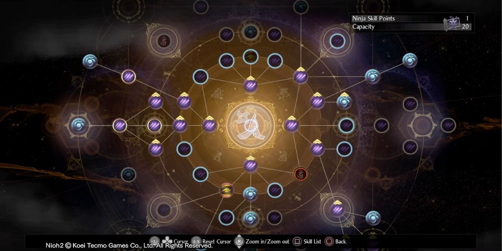
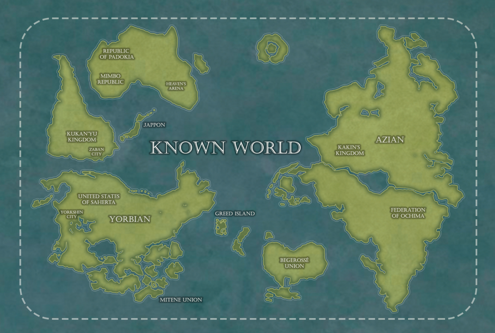

Recently, I've felt a bit lost about where to go in my career. I pride myself as a generalist and love to explore new domains and I felt like web/backend didn't have anything new to offer.

I've been wondering how `specialists` found their domain and what types of profiles exist in the wild.

> We value “T-shaped” people. That is, people who are both generalists (highly skilled at a broad set of valuable things—the top of the T) and also experts (among the best in their field within a narrow discipline—the vertical leg of the T.)  _ Valve's handbook

When first hearing this, it felt logical, and then I wondered: do people really just pick a single domain to become an expert in? Shouldn't we value V shaped people more?
Those questions began to sit in the back of my mind for a while and this blog is my answer.

My first observation was that no domain lives in isolation from the others. To give a simple example using webdev, no backend exists without its frontend. No one can be a backend expert without knowing how your API is going to be used and what could be its pain points.



If you feel hurt by this sentence, I hope it can serve as motivation for you to learn a bit about a new domain. fullstack is not a mediocre back & a mediocre front, it is a necessary path to become a better webdev.



The second observation I made is obvious: you do not know the depth of a domain without being an expert in it. You can use the Dunning Kruger graph to illustrate.

Domains can be hidden behind another unknown to you. For example, you wouldn't know about [NaN boxing or tagged pointers](https://piotrduperas.com/posts/nan-boxing) if you only do [webdev](https://x.com/mitchellh/status/1599117365622767616).

Seizing new knowledge (aka learning new stuff) is tiring and takes time. Learning everything at once is impossible. Knowing when to learn a new domain and when to focus on the current ones is an important skill.

Learning is a permanent dance between seizing new knowledge and settling on existing ones.
As long as you don't settle in every domain, you are still exploring the knowledge map. 

I still don't know how specialists define their subjects (do they just toss a coin and never change subject??), but I'll continue to explore new domains while working on my current projects. I recently moved to the DevOps/platform team of my company and I plan on learning computer graphics in 2025.

I don't have much to say, keep exploring the knowledge map ; I'm sure there's an island or two that are unexplored.

<!-- vim: set wrap: -->
